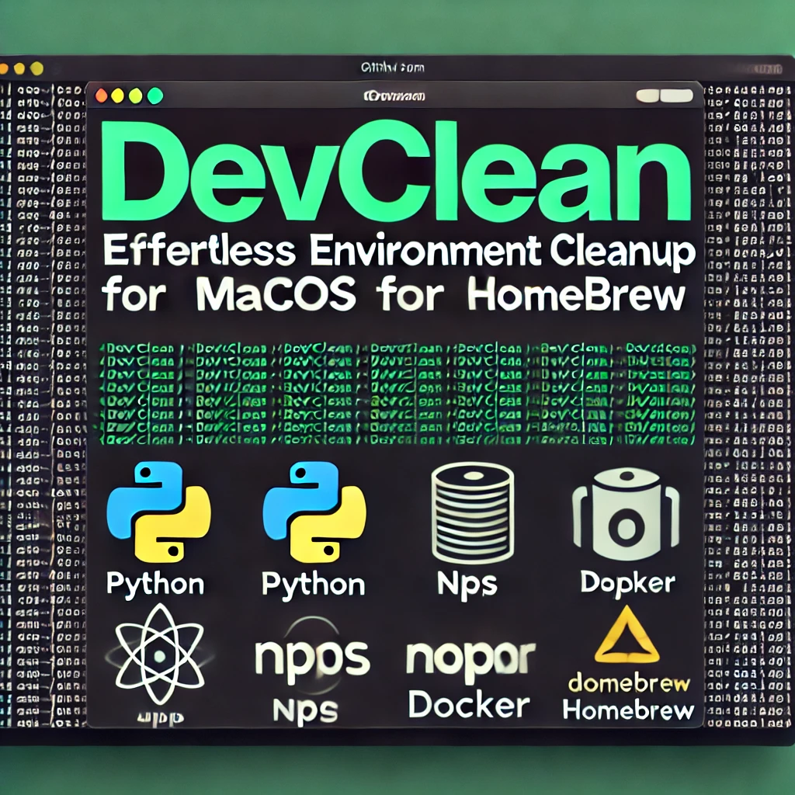

# DevEnvClean

 <!-- Placeholder for DevEnvClean logo -->

**DevEnvClean: Effortless Environment Cleanup for macOS Users**

DevEnvClean is a powerful and comprehensive cleanup script designed to keep your macOS development environment clean and efficient. It automates the removal of old virtual environments, clears caches, and frees up space by removing unnecessary files and directories. Whether you're dealing with Python bytecode files, Docker artifacts, or npm cache, DevEnvClean has got you covered.

## Features

- **Removes old virtual environments**
- **Cleans up Homebrew**
- **Clears pip, npm, and other tool caches**
- **Removes temporary and system cache files**
- **Cleans Docker artifacts**
- **Deletes old log files**
- **Removes old Python bytecode files**
- **Cleans Rust Cargo cache**
- **Removes Xcode derived data**
- **Cleans node_modules directories**
- **Clears VSCode workspace storage**
- **Cleans up git repositories**


## Installation

1. **Clone the Repository**:
   ```sh
   git clone https://github.com/BillySmithDesign/DevEnvClean-.git
   cd devclean
   ```

2. **Add Execute Permissions**:
   ```sh
   chmod +x cleanup.sh
   ```

## Usage

Simply run the script to clean up your macOS development environment:

```sh
./cleanup.sh
```


## Contributing

Feel free to contribute to DevEnvClean by submitting a pull request or opening an issue on GitHub.

## License

This project is licensed under the MIT License.
